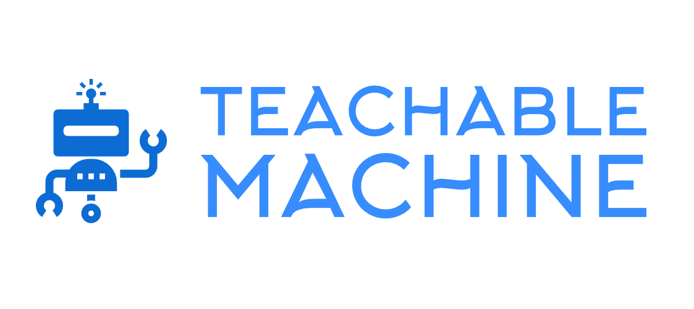

# Teachable Machine
_By: [Meqdad Darwish](https://github.com/MeqdadDev)_


<p align="center">
<picture>
  
</picture>
</p>

[](https://pepy.tech/project/teachable-machine)
[](https://choosealicense.com/licenses/mit/)
[](https://pypi.org/project/teachable-machine/)

A Python package designed to simplify the integration of exported models from Google's [Teachable Machine](https://teachablemachine.withgoogle.com/) platform into various environments.
This tool was specifically crafted to work seamlessly with Teachable Machine, making it easier to implement and use your trained models.

Source Code is published on [GitHub](https://github.com/MeqdadDev/teachable-machine)

Read more about the project (requirements, installation, examples and more) in the [Documentation Website](https://meqdaddev.github.io/teachable-machine/) 

## Supported Classifiers

**Image Classification**: use exported keras model from Teachable Machine platform.

## Requirements

``` Python >= 3.7 ```

## How to install package

```bash
pip install teachable-machine
```

## Example

An example for teachable machine package with OpenCV:

```python
from teachable_machine import TeachableMachine
import cv2 as cv

cap = cv.VideoCapture(0)
model = TeachableMachine(model_path="keras_model.h5",
                         labels_file_path="labels.txt")

image_path = "screenshot.jpg"

while True:
    _, img = cap.read()
    cv.imwrite(image_path, img)

    result, resultImage = model.classify_and_show(image_path)

    print("class_index", result["class_index"])

    print("class_name:::", result["class_name"])

    print("class_confidence:", result["class_confidence"])

    print("predictions:", result["predictions"])

    cv.imshow("Video Stream", resultImage)

    k = cv.waitKey(1)
    if k == 27:  # Press ESC to close the camera view
        break
    
cap.release()
cv.destroyAllWindows()
```

Values of `result` are assigned based on the content of `labels.txt` file.

For more; take a look on [these examples](https://meqdaddev.github.io/teachable-machine/codeExamples/)

### Links:

- [Documentation](https://meqdaddev.github.io/teachable-machine)

- [PyPI](https://pypi.org/project/teachable-machine/)

- [Source Code](https://github.com/MeqdadDev/teachable-machine)

- [Teachable Machine Platform](https://teachablemachine.withgoogle.com/)
