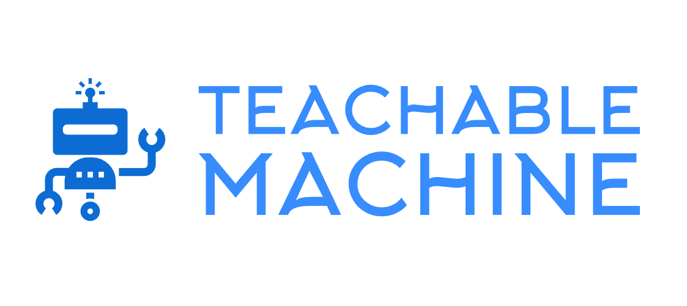

# Welcome to Teachable Machine Package
_By: [Meqdad Darwish](https://github.com/MeqdadDev)_

<picture>
  
</picture>

## Description
A Python package designed to simplify the integration of exported models from Google's [Teachable Machine](https://teachablemachine.withgoogle.com/) platform into various environments.
This tool was specifically crafted to work seamlessly with Teachable Machine, making it easier to implement and use your trained models.

Source Code is published on [GitHub](https://github.com/MeqdadDev/teachable-machine)

## Table Of Contents

1. [How-To Guide](how-to-guide.md)
2. [Requirements](requirements.md)
2. [Code Examples](codeExamples.md)
3. [Explanation](explanation.md)
4. [Contributing](contribution.md)

## Supported Classifiers

**Image Classification**

## Links

- [PyPI](https://pypi.org/project/teachable-machine/)

- [Source Code](https://github.com/MeqdadDev/teachable-machine)

- [Teachable Machine Platform](https://teachablemachine.withgoogle.com/)
